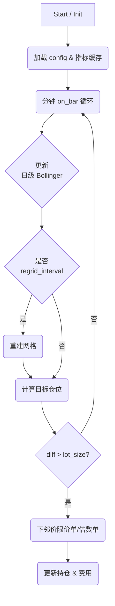

## 交易策略 - Code Agent 需求说明（精确可执行版）

> **目标**：实现「日级 Bollinger Band × 分钟级三层网格」做多策略，可在 QQQ／A 股 ETF／Crypto 上运行。

---

### 1. 数据输入

| 名称                      | 频率    | 字段                                | 说明                  |
| ----------------------- | ----- | --------------------------------- | ------------------- |
| **bar\_1m**             | 1 min | `ts, open, high, low, close, vol` | 连续 24 h / 场内 T+0 行情 |
| **trading\_calendar**   | 日     | `is_trading_day`                  | 用于判断窗口长度是否满足 MA     |
| **depth / tick** *(可选)* | 实时    | `bid, ask, bid_size, ask_size`    | 供精细限价用              |

---

### 2. 配置（示例 ）

```yaml
# === 指标 ===
ma_period:           20         # MA & σ 计算周期（交易日）
sigma_k:             1          # σ 乘数，用于分层
grid1_num:           10         # ±1σ 内格数
grid2_num:           6          # 1~2σ 区格数
grid3_num:           2
regrid_interval_min: 5          # 刷新网格分钟数

# === 费用 ===
fee_rate:     0.0003            # 佣金（成交金额×rate）
fee_min:      2.0               # 单笔最低佣金 (USD / CNY)
tax_rate:     0.001             # 卖出征税比例
lot_size:     1                 # 单位股数
tick_size:    0.01              # 最小价格跳动

# === 仓位 ===
min_position_pct: 0.10          # 最低保留 (10 %)
max_position_pct: 0.90          # 最高 (90 %)
```

---

### 3. 核心算法流程



---

### 4. 计算与规则

1. **Bollinger Band（分钟级更新）**

   * 维护 20 个交易日的日 K 数据；当前未收盘日蜡烛实时累加。
   * `MA = mean(close_[-20d:])`
   * `σ  = std(close_[-20d:])`

2. **网格重画（每 regrid\_interval\_min 执行）**

   * **中心** = `MA`
   * **±1σ** 区间平均分 `grid1_num` 格 ⇒ 节点 `grid1_edges = linspace(MA-σ, MA+σ, grid1_num+1)`
   * **1\~2σ** 区间平均分 `grid2_num` 格（上下独立）。
   * **2\~3σ** 区间平均分 `grid3_num` 格（上下独立）。

3. **目标仓位映射**

   ```
   if price >= MA+sigma:       target = 0.30*max_shares
   elif price <= MA-sigma:     target = 0.70*max_shares
   elif |price| < 1σ:          linear 分配至 40%
   # 1~2σ
   if price >= MA+2σ:          target = 0.15*max_shares
   elif price <= MA-2σ:        target = 0.85*max_shares
   elif 1σ<|price|<2σ:         linear 分配至 30%
   # 2~3σ
   if price >= MA+3σ:          target = 0.05*max_shares
   elif price <= MA-2σ:        target = 0.95*max_shares
   elif 1σ<|price|<2σ:         linear 分配至 20%
   ```

4. **下单原则**

   * **仅挂邻接价**：与当前 `price` 相差 `±tick_size` 的限价。
   * **穿档倍数单**：一次性跨过 n 格 → `order_size = n × lot_size × sign(diff)`。
   * 挂单未成交超过 `regrid_interval_min` 刷新时自动撤单。

5. **费用计算**

   ```
   fee = max(abs(order_value) * fee_rate, fee_min)
   tax = sell_value * tax_rate
   pnl -= fee + tax
   ```

   在目标仓位计算时不考虑，落单后实时扣减。

6. **24 h 超波动风控**

   * 定义“突破 2σ”事件：1 min bar 收盘价 > MA + 2σ 或 < MA − 2σ。
   * 使用固定长度 deque（1440）记录过去 24 h 次数。
   * **清仓逻辑**：计数 >`break2_limit` → `flat_all()` + `cooldown_min` 内拒绝下单。
   * **恢复逻辑**：计数 ≤ `break2_resume` 且冷却结束 → 恢复正常交易。

7. **盘前/盘后跳空** （仅美股 / ETF）

   * 若开盘价一次跨 n 格，立即撮合 n 倍 order 与目标仓位对齐。


### 5. 验收标准

| 指标   | 要求                                         |
| ---- | ------------------------------------------ |
| 回测运行 | 能加载 6 个月 1 min 数据并完成无报错回测                  |
| 风控触发 | 人为注入高波动数据，策略自动清仓并冷却                        |
| 代码质量 | 注释覆盖率 ≥ 60 %；单元测试 ≥ 80 % function coverage |

---

> **交付物**
>
> * `strategy.py`（核心策略模块）
> * `backtest.py`
> * `README.md`（运行说明）

此说明书已将策略逻辑、参数、接口与验收条件具体化，可直接交给 Code Agent 进行编码实现。祝开发顺利！
